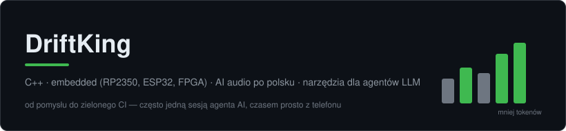

# 👋 Cześć, jestem DriftKing

Łączę dwa światy: **żelazo** (C++, FPGA, mikrokontrolery) i **AI** (synteza mowy po
polsku, narzędzia dla agentów LLM). Lubię projekty, które kończą się mierzalnym
dowodem — benchmarkiem, zielonym CI albo działającym sprzętem na biurku.

- 🎙️ **AI audio po polsku** — pipeline'y TTS i klonowania głosu z automatyczną
  gwarancją jakości (pętla ASR + CER), normalizacją głośności EBU R128 i konwersją RVC
- 🔌 **Embedded** — RP2350 (Pico 2), ESP32, FPGA Tang Nano (Verilog), PCB w KiCadzie
- 🤖 **Narzędzia dla agentów AI** — mniej tokenów, szybsze hooki, twarde benchmarki
- 🛠️ Buduję z pomocą agentów AI (Claude Code, Gemini) — od pomysłu do publicznego
  repo z CI potrafi minąć jedna sesja, czasem prowadzona z telefonu

---

## 🚀 Wybrane projekty

### [tok](https://github.com/gangg111/tok) — uniwersalne proxy odchudzające tokeny
Filtruje i kompresuje wyjścia komend CLI **zanim trafią do kontekstu LLM**
(Claude Code / Gemini / Copilot / Cursor). Czysty Rust **bez ani jednego crate'a**
(build samym `rustc`, binarka ~600 kB) + fallback w jednym pliku Pythona.
Zbudowany, żeby pokonać [rtk](https://github.com/rtk-ai/rtk) (61k★) — i wygrywa
w benchmarkach: **86,6% vs 27,8% redukcji tokenów**, hook PreToolUse 2–5× szybszy,
dedup sesyjny, którego rtk nie ma, CI na trzech systemach. Całość powstała
w jednej sesji Claude Code na telefonie (Termux), a wynik potwierdziły m.in.
pojedynki bliźniaczych subagentów na żywym kodzie.

### [Lektor AI](https://github.com/gangg111/Lektor_AI) — polski lektor napędzany AI
Aplikacja desktopowa do syntezy mowy i dubbingu po polsku: TTS + klonowanie głosu
(RVC przez onnxruntime), **pętla gwarancji zgodności tekstu** (generuj → transkrybuj
ASR → porównaj CER z polską normalizacją liczebników i godzin → regeneruj),
profesjonalna głośność (EBU R128) i miks z tłem filmu. Dystrybucja jako frozen
build z dociąganymi paczkami GPU (CUDA / onnxruntime-gpu) — działa od strzału,
bez instalowania Pythona.

### [RP2350 UART Crash Diagnostics](https://github.com/gangg111/RP2350-UART-Crash-Diagnostics)
System diagnostyczny HardFault dla Raspberry Pi Pico 2 — przechwytuje stan
rejestrów przy awarii i wypycha go po UART, zanim rdzeń zdąży umrzeć na dobre.
`C++ · Pico SDK`

### [ESP32 Bluetooth Audio Receiver](https://github.com/gangg111/ESP32-Bluetooth-Audio-Receiver)
Odbiornik audio Bluetooth na ESP32 — embedded spotyka audio także po stronie sprzętu.

### [awesome-ai-voice](https://github.com/gangg111/awesome-ai-voice)
Kurowana lista narzędzi AI do głosu — TTS, klonowanie, konwersja, ASR.

---

## 🛠️ Stack techniczny

- **Hardware:** RP2350 (Pico 2), ESP32, Tang Nano (FPGA), własne PCB
- **Software:** C++, Rust (zero-dependency), Python, Verilog
- **AI/audio:** RVC, ASR/Whisper, pyloudnorm, PyInstaller + paczki runtime GPU
- **Warsztat:** Claude Code, Gemini/Antigravity, GitHub Actions

---

## 📊 GitHub w liczbach

---
*Na warsztacie: **n64_pico** — śledź postępy!*
